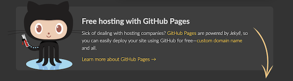

# My Personal Webpage

This is my personal webpage. It has been created using [GitHub Pages](https://pages.github.com/).

## Just a few words

Creating a site using [GitHub Pages](https://pages.github.com/) is quite simple but has some limitations: you will only be able to serve static pages with Javascript functionality.

If that fits you, you can can consider this two options:

- Using [Jekyll](https://docs.github.com/en/github/working-with-github-pages/setting-up-a-github-pages-site-with-jekyll): **GitHub Pages** are powered by **Jekyll** making a lot easier to publish new posts to your blog.

- Making a fully customization of your site. If you do so, I recommend you to deactivate Jekyll in order to avoid any troubles. To do this, just create a .nojekyll file on the root directory (just check this project root directory).
